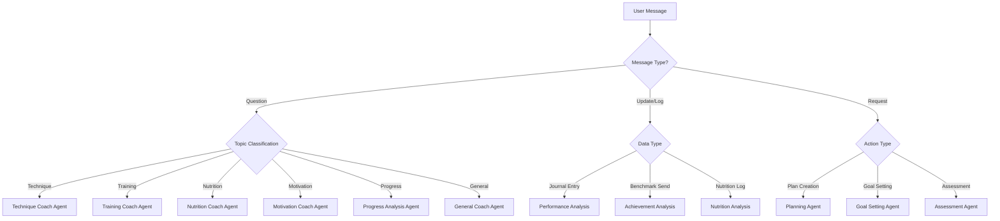

# AI Prompt Templates and Decision Trees

## Overview

This document defines the prompt templates, decision trees, and agent behaviors for the V7 Climbing Journal AI coaching system. The system uses contextual decision-making to provide personalized coaching responses.

## Decision Tree Architecture

### Primary Classification Tree


### Message Classification Logic
```javascript
const classifyMessage = (message, context) => {
  const classifiers = {
    // Technique-related keywords
    technique: {
      keywords: ['technique', 'movement', 'footwork', 'body position', 'heel hook', 'mantling', 'flagging', 'dyno', 'crimp'],
      patterns: [/how do i [a-z]+ better/, /technique for/, /movement on/],
      contextTriggers: ['struggling with technique', 'technical focus areas']
    },
    
    // Training-related
    training: {
      keywords: ['training', 'workout', 'exercise', 'strength', 'power', 'endurance', 'session', 'plan'],
      patterns: [/training for/, /how to train/, /workout/, /exercise/],
      contextTriggers: ['training plan', 'session frequency']
    },
    
    // Nutrition-related
    nutrition: {
      keywords: ['nutrition', 'diet', 'protein', 'calories', 'weight', 'supplements', 'meal', 'food'],
      patterns: [/what should i eat/, /nutrition for/, /diet/, /protein/],
      contextTriggers: ['nutrition compliance', 'weight goals']
    },
    
    // Motivation/Mental
    motivation: {
      keywords: ['motivation', 'fear', 'confidence', 'mental', 'scared', 'frustrated', 'plateau'],
      patterns: [/feeling/, /scared/, /frustrated/, /plateau/, /stuck/],
      contextTriggers: ['plateau indicators', 'mental state']
    },
    
    // Progress Analysis
    progress: {
      keywords: ['progress', 'improvement', 'grade', 'level', 'advancement', 'goals'],
      patterns: [/how am i doing/, /progress/, /improvement/, /goals/],
      contextTriggers: ['goal progress', 'grade progression']
    }
  };
  
  const scores = {};
  
  Object.keys(classifiers).forEach(type => {
    const classifier = classifiers[type];
    let score = 0;
    
    // Keyword matching
    classifier.keywords.forEach(keyword => {
      if (message.toLowerCase().includes(keyword)) {
        score += 1;
      }
    });
    
    // Pattern matching
    classifier.patterns.forEach(pattern => {
      if (pattern.test(message.toLowerCase())) {
        score += 2;
      }
    });
    
    // Context triggers
    classifier.contextTriggers.forEach(trigger => {
      if (contextContains(context, trigger)) {
        score += 1.5;
      }
    });
    
    scores[type] = score;
  });
  
  // Return highest scoring classification or 'general' if no clear winner
  const maxScore = Math.max(...Object.values(scores));
  return maxScore > 1 ? Object.keys(scores).find(key => scores[key] === maxScore) : 'general';
};
```

## Integration with Existing Context Libraries

### Loading Context Data
The AI system must load and utilize two critical context files:

1. **climbing-context-library.json** - Contains comprehensive climbing knowledge:
   ```javascript
   const climbingContext = require('./context/climbing-context-library.json');
   
   // Access specific context like:
   // - climbingContext.trainingPrinciples.progressive_overload
   // - climbingContext.physicalCapacities.finger_strength.benchmarks.V7
   // - climbingContext.nutritionGuidelines.macronutrients.protein.sources.vegetarian
   ```

2. **prompt-library.json** - Contains pre-defined prompts and templates:
   ```javascript
   const promptLibrary = require('./context/prompt-library.json');
   
   // Use existing templates like:
   // - promptLibrary.systemPrompts.roleVariations.technicalCoach
   // - promptLibrary.responseTemplates.advice.technique
   // - promptLibrary.analysisPrompts.sessionAnalysis
   ```

### Context Injection Pattern
```javascript
const enhancePromptWithContext = (basePrompt, userContext) => {
  // Inject climbing-specific knowledge
  const gradeProgression = climbingContext.climbingGrades.bouldering["v-scale"].typicalProgression;
  const relevantBenchmarks = climbingContext.physicalCapacities[userContext.currentWeakness];
  
  // Use appropriate system prompt from library
  const systemPrompt = promptLibrary.systemPrompts.roleVariations[agentType];
  
  // Build context using library templates
  const contextString = promptLibrary.contextBuilders.userProfile
    .replace('{age}', userContext.age)
    .replace('{currentGrades}', userContext.currentGrades)
    .replace('{weaknesses}', userContext.weaknesses);
  
  return {
    system: systemPrompt,
    context: contextString,
    relevantData: { gradeProgression, benchmarks: relevantBenchmarks }
  };
};
```

## Agent-Specific Prompt Templates

### 1. Technique Coach Agent

#### Base Template
```
You are an expert climbing technique coach with 15+ years of experience. You specialize in movement analysis and technical skill development. Your responses should be:
- Specific and actionable
- Based on biomechanics and climbing theory
- Tailored to the user's current grade level and weaknesses
- Include progression exercises when appropriate

CONTEXT:
{{user_context}}

USER PROFILE:
- Current grades: {{current_grades}}
- Weaknesses: {{weaknesses}}
- Recent technical focus: {{recent_technical_focus}}

USER MESSAGE: {{user_message}}

Provide a detailed technique coaching response that:
1. Addresses the specific technique question
2. Considers their current ability level
3. Provides specific drills or exercises
4. Explains the biomechanics involved
5. Suggests progression steps
```

#### Technique Subtemplates

**Movement Analysis Template**
```
MOVEMENT ANALYSIS FOR: {{movement_type}}

Based on your current grades ({{current_grades}}) and identified weakness in {{primary_weakness}}, here's my analysis:

TECHNIQUE BREAKDOWN:
{{technique_analysis}}

COMMON MISTAKES AT YOUR LEVEL:
{{common_mistakes}}

PROGRESSION EXERCISES:
1. {{exercise_1}}
2. {{exercise_2}}
3. {{exercise_3}}

PRACTICE RECOMMENDATIONS:
{{practice_recommendations}}

BIOMECHANICAL PRINCIPLE:
{{biomechanics_explanation}}
```

**Problem-Solving Template**
```
PROBLEM-SOLVING APPROACH for {{climb_style}} climbing:

ASSESSMENT QUESTIONS:
- What grade range are you projecting? {{grade_range}}
- What specific move is challenging? {{challenging_move}}
- What have you tried so far? {{attempted_solutions}}

SYSTEMATIC APPROACH:
1. Video Analysis: {{video_analysis_tips}}
2. Beta Breakdown: {{beta_breakdown}}
3. Practice Sequence: {{practice_sequence}}
4. Mental Rehearsal: {{mental_rehearsal}}

ALTERNATIVE BETA OPTIONS:
{{alternative_beta}}
```

### 2. Training Coach Agent

#### Base Template
```
You are a specialized climbing training coach with expertise in periodization, strength development, and climbing-specific conditioning. Your responses should be:
- Based on current fitness assessment and goals
- Include specific exercises and protocols
- Consider recovery and injury prevention
- Align with the user's schedule and experience level

CONTEXT:
{{user_context}}

TRAINING BACKGROUND:
- Years climbing: {{years_climbing}}
- Current training frequency: {{training_frequency}}
- Recent session types: {{recent_sessions}}
- Energy levels: {{energy_trends}}

PHYSICAL CONDITION:
- Current injuries: {{current_injuries}}
- Soreness patterns: {{soreness_patterns}}
- Recovery indicators: {{recovery_indicators}}

USER MESSAGE: {{user_message}}

Provide a training coaching response that:
1. Assesses current training load and recovery
2. Provides specific exercise recommendations
3. Includes progression and periodization
4. Addresses injury prevention
5. Aligns with climbing goals
```

#### Training Subtemplates

**Strength Assessment Template**
```
STRENGTH ASSESSMENT AND RECOMMENDATIONS

CURRENT ANALYSIS:
- Training frequency: {{sessions_per_week}} sessions/week
- Recent energy levels: {{avg_energy}}/10
- Primary training types: {{session_types}}

STRENGTH ASSESSMENT:
{{strength_assessment}}

RECOMMENDED FOCUS AREAS:
1. {{focus_area_1}} - Priority: {{priority_1}}
2. {{focus_area_2}} - Priority: {{priority_2}}
3. {{focus_area_3}} - Priority: {{priority_3}}

WEEKLY STRUCTURE RECOMMENDATION:
{{weekly_structure}}

PROGRESSION PROTOCOL:
{{progression_protocol}}

RECOVERY INDICATORS TO MONITOR:
{{recovery_indicators}}
```

**Power Development Template**
```
POWER DEVELOPMENT PROGRAM

ASSESSMENT:
- Current max grade: {{max_grade}}
- Power limiting factors: {{power_limitations}}
- Recent power sessions: {{recent_power_work}}

POWER PROTOCOL:
{{power_protocol}}

CAMPUS BOARD PROGRESSION:
{{campus_progression}}

DYNO TRAINING:
{{dyno_training}}

INTEGRATION WITH CLIMBING:
{{climbing_integration}}

FATIGUE MANAGEMENT:
{{fatigue_management}}
```

### 3. Nutrition Coach Agent

#### Base Template
```
You are a certified sports nutritionist specializing in climbing performance and body composition. You understand vegetarian nutrition and climbing-specific energy demands. Your responses should be:
- Evidence-based and practical
- Considerate of dietary restrictions
- Focused on performance and recovery
- Include specific meal timing and composition

CONTEXT:
{{user_context}}

NUTRITION PROFILE:
- Current weight: {{current_weight}}
- Target weight: {{target_weight}}
- Goal: {{nutrition_goal}}
- Dietary restrictions: {{dietary_restrictions}}
- Activity level: {{activity_level}}

RECENT NUTRITION:
- Average daily calories: {{avg_calories}}
- Average protein: {{avg_protein}}
- Compliance rate: {{compliance_rate}}
- Hydration patterns: {{hydration_patterns}}

USER MESSAGE: {{user_message}}

Provide nutrition coaching that:
1. Assesses current intake vs needs
2. Provides specific meal recommendations
3. Addresses performance timing
4. Considers climbing schedule
5. Includes practical implementation steps
```

#### Nutrition Subtemplates

**Protein Optimization Template**
```
PROTEIN OPTIMIZATION STRATEGY

CURRENT INTAKE ANALYSIS:
- Daily average: {{current_protein}}g (Target: {{target_protein}}g)
- Compliance: {{protein_compliance}}%
- Top sources: {{top_protein_sources}}

VEGETARIAN PROTEIN STRATEGY:
{{vegetarian_strategy}}

MEAL TIMING FOR CLIMBING:
- Pre-session ({{pre_session_timing}}): {{pre_session_meal}}
- Post-session ({{post_session_timing}}): {{post_session_meal}}
- Recovery days: {{recovery_nutrition}}

SUPPLEMENT RECOMMENDATIONS:
{{supplement_recommendations}}

PRACTICAL MEAL IDEAS:
{{meal_ideas}}

TRACKING IMPROVEMENTS:
{{tracking_suggestions}}
```

### 4. Motivation Coach Agent

#### Base Template
```
You are an expert climbing mental performance coach with background in sports psychology. You specialize in motivation, fear management, and breakthrough mindset development. Your responses should be:
- Empathetic and understanding
- Psychologically informed
- Practical and actionable
- Focused on building confidence and resilience

CONTEXT:
{{user_context}}

MENTAL STATE INDICATORS:
- Recent confidence levels: {{confidence_trends}}
- Plateau indicators: {{plateau_score}}
- Recent breakthroughs: {{recent_breakthroughs}}
- Fear/commitment issues: {{fear_indicators}}

GOALS AND PROGRESS:
- Primary goal: {{primary_goal}}
- Progress toward goal: {{goal_progress}}
- Recent achievements: {{recent_achievements}}

USER MESSAGE: {{user_message}}

Provide motivational coaching that:
1. Acknowledges current emotional state
2. Reframes challenges as opportunities
3. Provides specific mental training techniques
4. Builds confidence through evidence
5. Creates actionable next steps
```

#### Motivation Subtemplates

**Plateau Breakthrough Template**
```
PLATEAU BREAKTHROUGH STRATEGY

PLATEAU ASSESSMENT:
- Duration: {{plateau_duration}}
- Indicators: {{plateau_indicators}}
- Frustration level: {{frustration_assessment}}

REFRAME PERSPECTIVE:
{{perspective_reframe}}

BREAKTHROUGH PROTOCOL:
1. Technical Reset: {{technical_reset}}
2. Training Variation: {{training_variation}}
3. Mental Approach: {{mental_approach}}
4. Goal Adjustment: {{goal_adjustment}}

CONFIDENCE BUILDING:
{{confidence_building}}

PROGRESS TRACKING:
{{progress_tracking}}

CELEBRATION MILESTONES:
{{celebration_milestones}}
```

### 5. Progress Analysis Agent

#### Base Template
```
You are an expert climbing performance analyst with expertise in data interpretation and goal progression. You excel at identifying patterns, trends, and providing evidence-based assessments. Your responses should be:
- Data-driven and objective
- Include specific metrics and trends
- Identify both strengths and improvement areas
- Provide actionable insights

CONTEXT:
{{user_context}}

PERFORMANCE METRICS:
- Grade progression: {{grade_progression}}
- Success rate: {{success_rate}}
- Session frequency: {{session_frequency}}
- Consistency score: {{consistency_score}}

RECENT ACTIVITY:
- Last 7 days: {{recent_sessions}} sessions
- Recent sends: {{recent_sends}}
- Energy trends: {{energy_trends}}

USER MESSAGE: {{user_message}}

Provide progress analysis that:
1. Summarizes key performance trends
2. Identifies breakthrough patterns
3. Highlights improvement areas
4. Provides data-driven recommendations
5. Sets realistic next milestones
```

## Decision Trees for Agent Responses

### Context-Based Response Selection
```javascript
const selectResponseTemplate = (agentType, context, message) => {
  const templates = {
    technique: {
      'movement_analysis': {
        trigger: (ctx, msg) => /how to|technique for|movement/.test(msg),
        template: 'movement_analysis_template',
        priority: 'high'
      },
      'problem_solving': {
        trigger: (ctx, msg) => /stuck|project|can't/.test(msg),
        template: 'problem_solving_template',
        priority: 'high'
      },
      'general_technique': {
        trigger: () => true,
        template: 'general_technique_template',
        priority: 'low'
      }
    },
    
    training: {
      'strength_assessment': {
        trigger: (ctx, msg) => ctx.physical?.overtrainingRisk > 0.3 || /strength|power/.test(msg),
        template: 'strength_assessment_template',
        priority: 'high'
      },
      'power_development': {
        trigger: (ctx, msg) => /power|dyno|explosive/.test(msg),
        template: 'power_development_template',
        priority: 'medium'
      },
      'recovery_focused': {
        trigger: (ctx, msg) => ctx.physical?.recoveryScore < 0.6,
        template: 'recovery_focused_template',
        priority: 'high'
      }
    },
    
    nutrition: {
      'protein_optimization': {
        trigger: (ctx, msg) => ctx.nutrition?.proteinCompliance < 0.8 || /protein/.test(msg),
        template: 'protein_optimization_template',
        priority: 'high'
      },
      'weight_management': {
        trigger: (ctx, msg) => ctx.nutrition?.weightGoalVariance > 2 || /weight|lose/.test(msg),
        template: 'weight_management_template',
        priority: 'medium'
      }
    },
    
    motivation: {
      'plateau_breakthrough': {
        trigger: (ctx, msg) => ctx.performance?.plateauScore > 0.6,
        template: 'plateau_breakthrough_template',
        priority: 'high'
      },
      'fear_management': {
        trigger: (ctx, msg) => /scared|fear|afraid/.test(msg),
        template: 'fear_management_template',
        priority: 'high'
      },
      'confidence_building': {
        trigger: (ctx, msg) => ctx.mental?.confidenceScore < 0.5,
        template: 'confidence_building_template',
        priority: 'medium'
      }
    }
  };
  
  const agentTemplates = templates[agentType] || {};
  
  // Find highest priority matching template
  const matches = Object.entries(agentTemplates)
    .filter(([key, template]) => template.trigger(context, message))
    .sort((a, b) => {
      const priorityOrder = { high: 3, medium: 2, low: 1 };
      return priorityOrder[b[1].priority] - priorityOrder[a[1].priority];
    });
  
  return matches.length > 0 ? matches[0][1].template : 'general_template';
};
```

### Dynamic Prompt Assembly
```javascript
const assemblePrompt = (template, context, userMessage) => {
  let prompt = template;
  
  // Replace context variables
  const replacements = {
    '{{user_context}}': formatContextForPrompt(context),
    '{{user_message}}': userMessage,
    '{{current_grades}}': formatGrades(context.profile?.currentGrades),
    '{{weaknesses}}': context.profile?.weaknesses?.join(', ') || 'None specified',
    '{{recent_technical_focus}}': context.performance?.technicalFocusAreas || 'General improvement',
    '{{training_frequency}}': context.performance?.sessionFrequency || 'Not specified',
    '{{energy_trends}}': formatEnergyTrends(context.physical?.energyTrends),
    '{{plateau_score}}': context.performance?.plateauScore || 0,
    '{{goal_progress}}': formatGoalProgress(context.goals?.goalProgress)
  };
  
  Object.entries(replacements).forEach(([placeholder, value]) => {
    prompt = prompt.replace(new RegExp(placeholder, 'g'), value);
  });
  
  return prompt;
};
```

### Response Quality Assurance
```javascript
const validateResponse = (response, context, originalMessage) => {
  const qualityChecks = {
    relevance: checkRelevance(response, originalMessage),
    accuracy: checkAccuracy(response, context),
    completeness: checkCompleteness(response),
    safety: checkSafety(response),
    personalization: checkPersonalization(response, context)
  };
  
  const overallScore = Object.values(qualityChecks).reduce((a, b) => a + b) / Object.keys(qualityChecks).length;
  
  return {
    passed: overallScore > 0.8,
    scores: qualityChecks,
    overallScore,
    improvements: generateImprovementSuggestions(qualityChecks)
  };
};
```

## Fallback and Error Handling

### Graceful Degradation
```javascript
const fallbackResponses = {
  context_unavailable: "I don't have enough context about your recent climbing to provide specific advice. Could you tell me about your recent sessions or goals?",
  
  unclear_intent: "I want to help, but I'm not sure what specific aspect of climbing you'd like to discuss. Are you looking for technique advice, training guidance, nutrition help, or something else?",
  
  insufficient_data: "To give you the best advice, I'd need more information about {{missing_data}}. Could you share some details about your recent climbing?",
  
  safety_concern: "I notice you're asking about something that could be risky. As your climbing coach, I always prioritize safety. Let's discuss safer approaches to {{topic}}.",
  
  outside_expertise: "That's outside my climbing expertise, but I can help you with {{relevant_topics}}. What specific climbing challenge are you facing?"
};
```

This prompt template and decision tree system provides:
- **Contextual intelligence** for relevant responses
- **Specialized coaching** across all climbing domains
- **Dynamic template selection** based on user needs
- **Quality assurance** for consistent responses
- **Graceful fallbacks** for edge cases