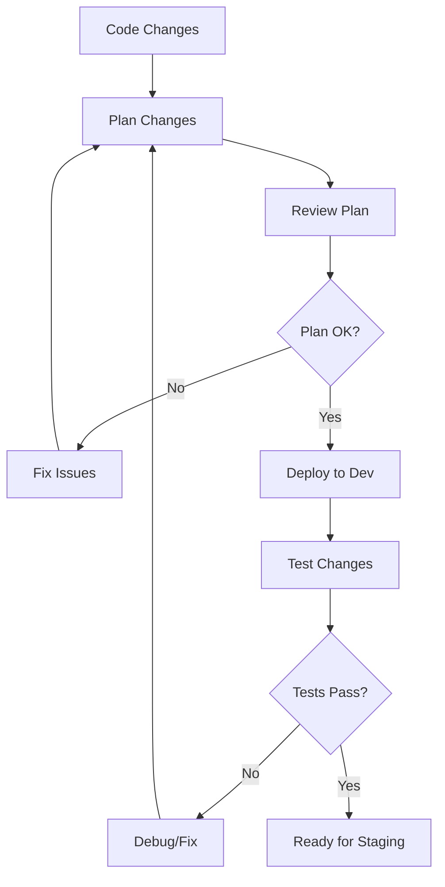
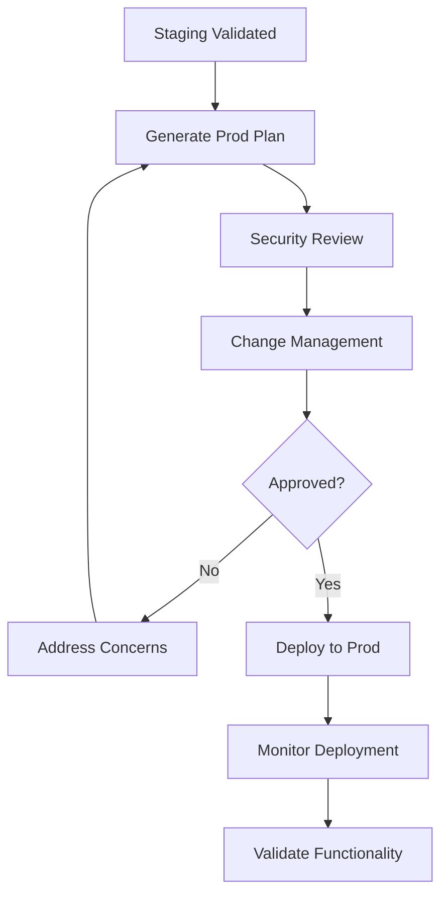

# Terraform Workflow and Best Practices

## Overview

This document outlines the complete workflow for managing AWS infrastructure using Terraform for the V7 Climbing Journal project. Follow these practices to ensure safe, consistent deployments.

## Quick Start

### 1. Initial Setup (One-time per environment)

```bash
# Create state backend
./scripts/init-state-backend.sh -e dev

# Initialize environment
cd environments/dev
terraform init
```

### 2. Daily Development Workflow

```bash
# Plan changes
./scripts/deploy.sh -e dev --plan-only

# Deploy to dev environment  
./scripts/deploy.sh -e dev

# Deploy specific module
./scripts/deploy.sh -e dev -m database
```

### 3. Production Deployment

```bash
# Always plan first for production
./scripts/deploy.sh -e prod --plan-only

# Deploy to production (requires manual confirmation)
./scripts/deploy.sh -e prod
```

## Project Structure Overview

```
terraform/
├── environments/           # Environment-specific configurations
│   ├── dev/               # Development environment
│   ├── staging/           # Staging environment  
│   └── prod/              # Production environment
├── modules/               # Reusable Terraform modules
│   ├── database/          # DynamoDB tables and indexes
│   ├── lambda-functions/  # Lambda functions and layers
│   ├── api-gateway/       # API Gateway resources
│   └── ...               # Other service modules
├── scripts/               # Deployment and utility scripts
└── docs/                  # Documentation
```

## Environment Management

### Environment Isolation

Each environment (dev/staging/prod) has:
- **Separate Terraform state** stored in different S3 buckets
- **Independent AWS resources** with environment-specific naming
- **Environment-specific variables** for configuration differences
- **Separate IAM permissions** for access control

### Environment Configuration Files

Each environment directory contains:
- `main.tf` - Module composition and resource instantiation
- `variables.tf` - Variable definitions
- `terraform.tfvars` - Environment-specific values
- `backend.tf` - Remote state configuration
- `outputs.tf` - Environment outputs

## Module Development Guidelines

### 1. Single Responsibility Principle

Each module should manage a specific domain:

```hcl
# ✅ Good - Database module only manages DynamoDB
module "database" {
  source = "../../modules/database"
  # ...
}

# ❌ Bad - Don't mix unrelated resources
module "database_and_lambda" {
  # Contains both DynamoDB and Lambda resources
}
```

### 2. Clear Input/Output Contracts

```hcl
# modules/database/variables.tf
variable "environment" {
  description = "Environment name (dev, staging, prod)"
  type        = string
  validation {
    condition     = contains(["dev", "staging", "prod"], var.environment)
    error_message = "Environment must be dev, staging, or prod."
  }
}

# modules/database/outputs.tf
output "table_names" {
  description = "Map of logical names to DynamoDB table names"
  value = {
    users = aws_dynamodb_table.users.name
    # ...
  }
}
```

### 3. Environment-Aware Naming

```hcl
# Use consistent naming patterns
resource "aws_dynamodb_table" "users" {
  name = "${var.environment}-v7-users"
  # ...
}
```

## Deployment Workflows

### Development Environment



### Production Environment



## Safety Practices

### 1. Always Plan Before Apply

```bash
# Generate and review plan
terraform plan -out=tfplan

# Review plan contents
terraform show tfplan

# Apply only after review
terraform apply tfplan
```

### 2. Target Specific Resources When Needed

```bash
# Update only database module
terraform plan -target=module.database
terraform apply -target=module.database

# Update specific resource
terraform plan -target=aws_dynamodb_table.users
```

### 3. Use Import for Existing Resources

```bash
# Import existing resource to avoid recreation
terraform import aws_dynamodb_table.users existing-table-name
```

### 4. Backup State Before Major Changes

```bash
# Backup current state
terraform state pull > backup-$(date +%Y%m%d_%H%M%S).tfstate

# Restore from backup if needed
terraform state push backup-file.tfstate
```

## Variable Management

### Environment-Specific Variables

```hcl
# environments/dev/terraform.tfvars
database_config = {
  billing_mode           = "PAY_PER_REQUEST"
  point_in_time_recovery = false
  backup_retention_days  = 1
}

# environments/prod/terraform.tfvars  
database_config = {
  billing_mode           = "PROVISIONED"
  read_capacity          = 10
  write_capacity         = 5
  point_in_time_recovery = true
  backup_retention_days  = 30
}
```

### Sensitive Variables

```hcl
# Mark sensitive outputs
output "database_arns" {
  value     = module.database.table_arns
  sensitive = true
}

# Use AWS Systems Manager for secrets
data "aws_ssm_parameter" "api_key" {
  name = "/${var.environment}/v7/api-key"
}
```

## State Management

### Remote State Configuration

```hcl
# environments/prod/backend.tf
terraform {
  backend "s3" {
    bucket         = "v7-terraform-state-prod"
    key            = "prod/terraform.tfstate"
    region         = "us-east-1"
    encrypt        = true
    dynamodb_table = "v7-terraform-locks-prod"
  }
}
```

### State Operations

```bash
# List resources in state
terraform state list

# Show specific resource
terraform state show aws_dynamodb_table.users

# Move resource to different address
terraform state mv aws_dynamodb_table.old_name aws_dynamodb_table.new_name

# Remove resource from state (doesn't destroy)
terraform state rm aws_dynamodb_table.users
```

## Troubleshooting Common Issues

### 1. State Lock Issues

```bash
# Check for existing locks
aws dynamodb scan --table-name v7-terraform-locks-dev

# Force unlock (use carefully)
terraform force-unlock LOCK_ID
```

### 2. Resource Conflicts

```bash
# Import existing resource
terraform import aws_dynamodb_table.users existing-table-name

# Or exclude from state temporarily
terraform state rm aws_dynamodb_table.users
```

### 3. Module Dependencies

```bash
# Refresh state to update dependencies
terraform refresh

# Target parent module first
terraform apply -target=module.database
terraform apply -target=module.lambda_functions
```

## CI/CD Integration

### GitHub Actions Workflow

The project includes a GitHub Actions workflow that:
- **Validates** Terraform configuration on all PRs
- **Plans** changes for dev/staging environments  
- **Auto-deploys** to dev environment on main branch
- **Requires manual approval** for production deployments

### Pre-commit Hooks

```bash
# Install pre-commit hooks
pip install pre-commit
pre-commit install

# Hooks include:
# - terraform fmt
# - terraform validate  
# - terraform security scan
```

## Monitoring and Alerting

### CloudWatch Alarms

```hcl
resource "aws_cloudwatch_metric_alarm" "dynamodb_throttle" {
  alarm_name          = "${var.environment}-v7-dynamodb-throttle"
  comparison_operator = "GreaterThanThreshold"
  evaluation_periods  = "2"
  metric_name         = "UserErrors"
  namespace           = "AWS/DynamoDB"
  period              = "300"
  statistic           = "Sum"
  threshold           = "0"
  alarm_description   = "This metric monitors DynamoDB throttling"
  alarm_actions       = [aws_sns_topic.alerts.arn]
}
```

### Cost Monitoring

```hcl
resource "aws_budgets_budget" "monthly_cost" {
  name         = "${var.environment}-v7-monthly-budget"
  budget_type  = "COST"
  limit_amount = var.monthly_budget_limit
  limit_unit   = "USD"
  time_unit    = "MONTHLY"
  
  cost_filters = {
    Tag = ["Project:v7-climbing-journal"]
  }
}
```

## Security Best Practices

### 1. IAM Principle of Least Privilege

```hcl
data "aws_iam_policy_document" "lambda_dynamodb" {
  statement {
    effect = "Allow"
    actions = [
      "dynamodb:GetItem",
      "dynamodb:PutItem",
      "dynamodb:UpdateItem",
      "dynamodb:DeleteItem"
    ]
    resources = [
      aws_dynamodb_table.users.arn,
      "${aws_dynamodb_table.users.arn}/*"
    ]
  }
}
```

### 2. Encryption at Rest and Transit

```hcl
resource "aws_dynamodb_table" "users" {
  name     = "${var.environment}-v7-users"
  
  server_side_encryption {
    enabled     = true
    kms_key_id  = aws_kms_key.dynamodb.arn
  }
}
```

### 3. Network Security

```hcl
resource "aws_security_group" "lambda" {
  name_prefix = "${var.environment}-v7-lambda"
  
  egress {
    from_port   = 443
    to_port     = 443
    protocol    = "tcp"
    cidr_blocks = ["0.0.0.0/0"]
  }
  
  # No ingress rules - Lambda doesn't need direct access
}
```

## Performance Optimization

### 1. DynamoDB Optimization

```hcl
# Use auto-scaling for production
resource "aws_appautoscaling_target" "dynamodb_table_read_target" {
  count              = var.environment == "prod" ? 1 : 0
  max_capacity       = 100
  min_capacity       = 5
  resource_id        = "table/${aws_dynamodb_table.users.name}"
  scalable_dimension = "dynamodb:table:ReadCapacityUnits"
  service_namespace  = "dynamodb"
}
```

### 2. Lambda Optimization

```hcl
resource "aws_lambda_function" "user_crud" {
  # Use ARM64 for better price/performance
  architectures = ["arm64"]
  
  # Enable provisioned concurrency for production
  dynamic "provisioned_concurrency" {
    for_each = var.environment == "prod" ? [1] : []
    content {
      provisioned_concurrent_executions = 10
    }
  }
}
```

This workflow ensures safe, consistent, and maintainable infrastructure management while preventing common deployment issues and resource conflicts.